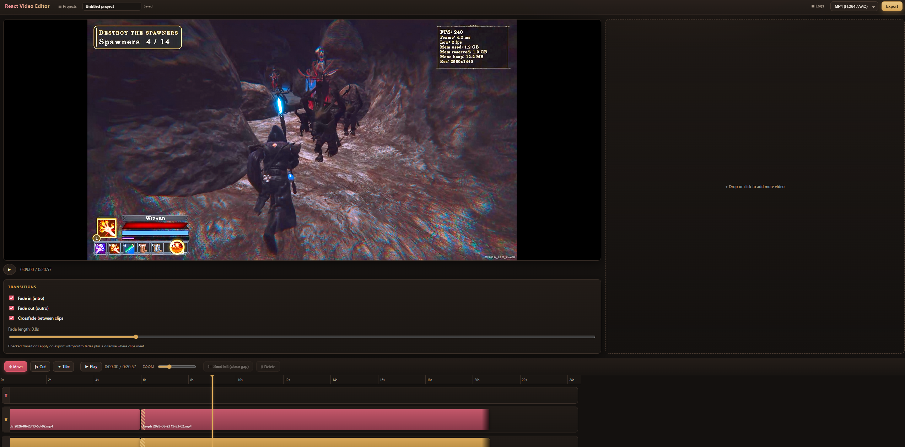

# React Video Editor

A browser based video editor built with React and Vite. Drag in a video, cut and
arrange it on a multi track timeline, add titles with any Google Font, apply fade
and crossfade transitions, then export a real video file at the source resolution
(2K in, 2K out) using ffmpeg.wasm. Everything runs locally in the browser. No
uploads, no server.



## Features

- **Drag and drop import.** Drop any video (MP4, MOV, MKV, WebM) onto the panel.
  Each import lands as a linked video clip plus audio clip, automatically split
  onto separate V and A lanes.
- **Cut tool.** Splits the clip under the playhead. Video and audio are cut
  independently, so cutting one then the other lands both on the same playhead
  time and they stay in sync.
- **Move tool and trim handles.** Drag clips left and right, or drag a clip edge to
  trim its in and out points.
- **Multi select and ripple.** Ctrl or Cmd click to select multiple clips across
  lanes, drag them as a block, and use "Send left (close gap)" to slide the
  selection back against the previous clip while keeping video and audio aligned.
- **Titles and subtext.** Add a title clip, type a title and optional subtext, pick
  from roughly 70 Google Fonts, set sizes, colors, alignment, bold, italic, and
  outline, then drag it to position in the preview. Titles are baked into the
  export pixel for pixel.
- **Transitions.** Checkboxes for fade in (intro), fade out (outro), and crossfade
  between clips, plus a fade length slider. Checked transitions are applied on
  export.
- **Projects.** Autosaves to the browser (IndexedDB) including the source video
  blobs, reopens your last project on load, and lets you rename, create, open, and
  delete projects.
- **Export.** MP4 (H.264 / AAC), MOV, MKV, or WebM (VP9 / Opus). No scaling is
  applied, so the output keeps the imported resolution. H.264 uses CRF 18 (visually
  lossless). A live, scrollable ffmpeg log console and a real progress percentage
  (parsed from ffmpeg's own time output) show what is happening.

## Keyboard shortcuts

| Key | Action |
| --- | --- |
| `V` | Move tool |
| `C` | Cut tool |
| `Space` | Play / pause |
| `Delete` / `Backspace` | Delete selected clips |

## Run

Requires Node.js 18 or newer.

```bash
npm install
npm run dev      # http://localhost:5173
npm run build    # production bundle in dist/
```

The first export downloads the ffmpeg core (about 32 MB) from a CDN, then it is
cached. Google Fonts also load from the CDN, so the title fonts need an internet
connection. The editor itself runs fully offline once the page is loaded.

## How export works

ffmpeg.wasm trims each clip from its source and joins the clips in timeline order.
Gaps between clips are preserved: video gaps are filled with black and audio gaps
with silence, so a clip that sits at 0:05 still starts at 0:05 in the output. With
crossfade enabled the clips are chained with `xfade` and `acrossfade` instead.
Intro and outro fades are applied to the final stream. Each title is rendered to a
full frame transparent PNG using the exact web font and overlaid for its time
range, so the export matches the preview.

### Notes and limitations

- ffmpeg.wasm runs on the CPU only. The browser has no path to GPU encoders, so
  large exports take time. A faster `veryfast` x264 preset is used by default. For
  GPU accelerated encoding you would need a native build (for example Electron with
  a real ffmpeg using `h264_nvenc`).
- The multi threaded ffmpeg core can hang during encoding on some setups, so the
  reliable single threaded core is the default. The flag to switch is `PREFER_MT`
  in `src/lib/exporter.js`.
- Overlapping clips placed without crossfade collapse to back to back. Use the
  crossfade checkbox for an intentional dissolve on overlap.

## Tech

React 18, Vite 5, ffmpeg.wasm (`@ffmpeg/ffmpeg`), the canvas 2D API for title
rendering, and IndexedDB for project storage. No backend.
